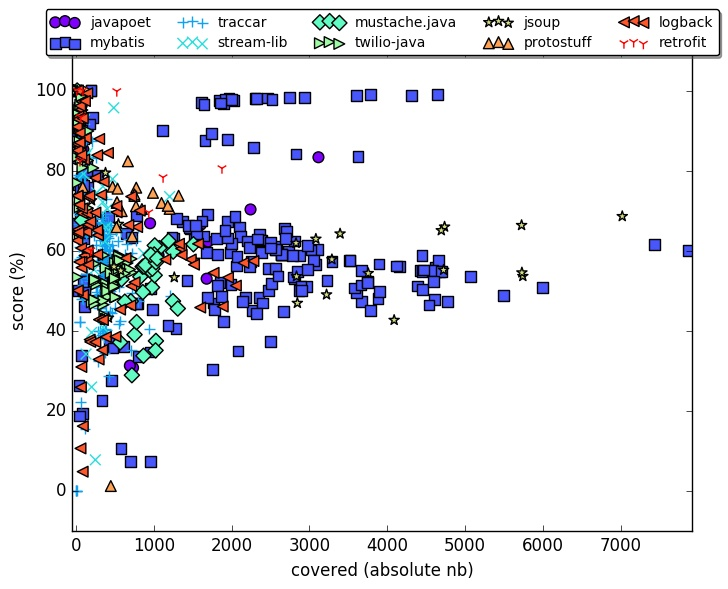
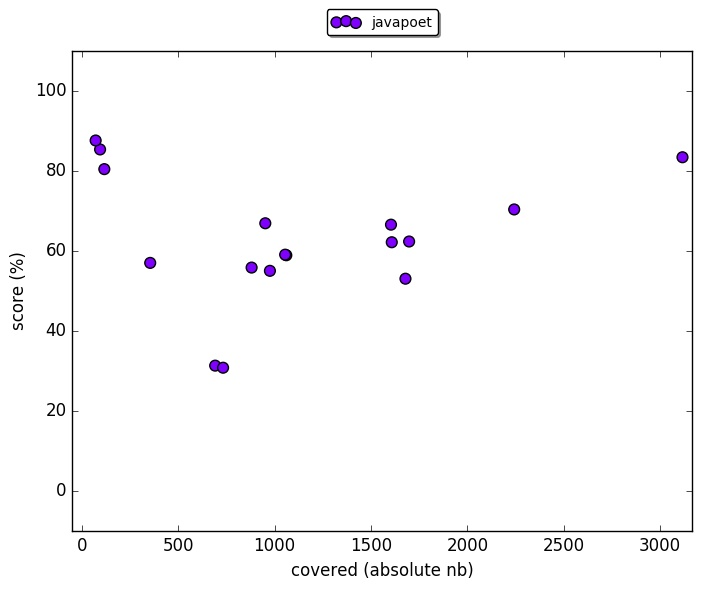
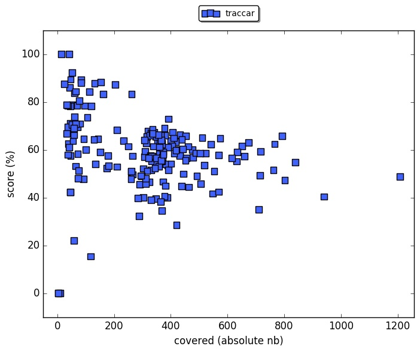
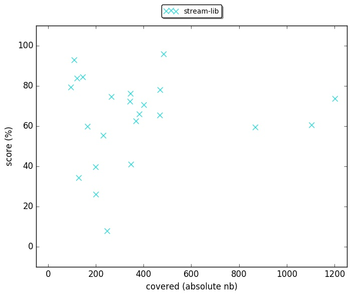
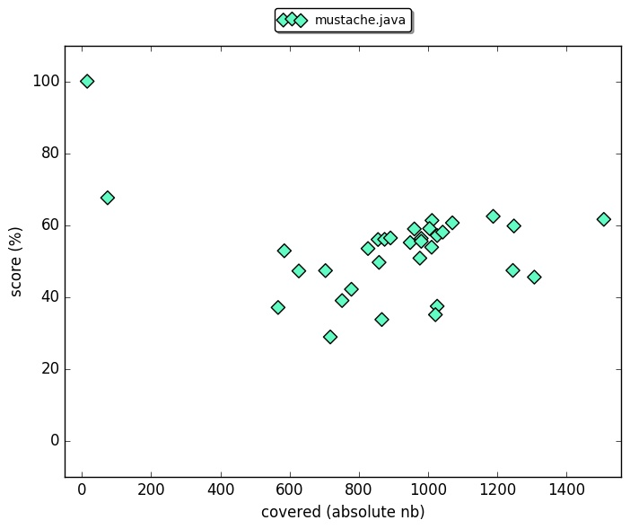
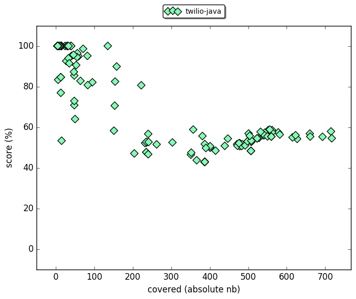
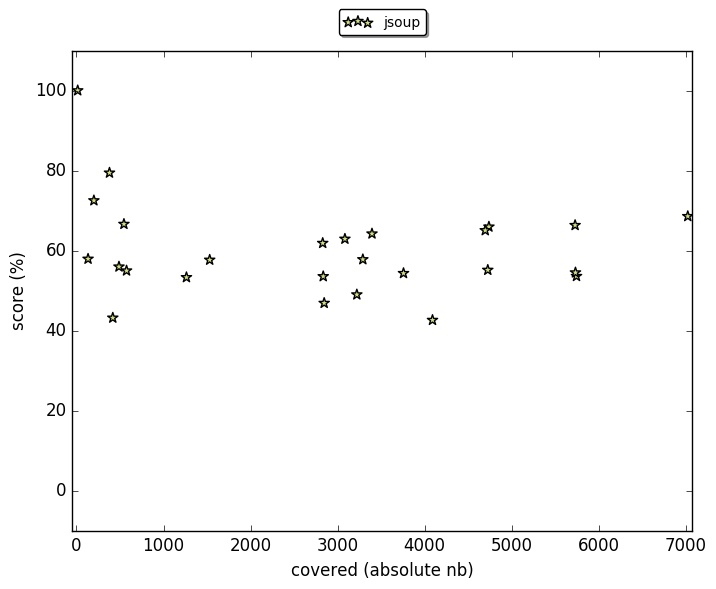
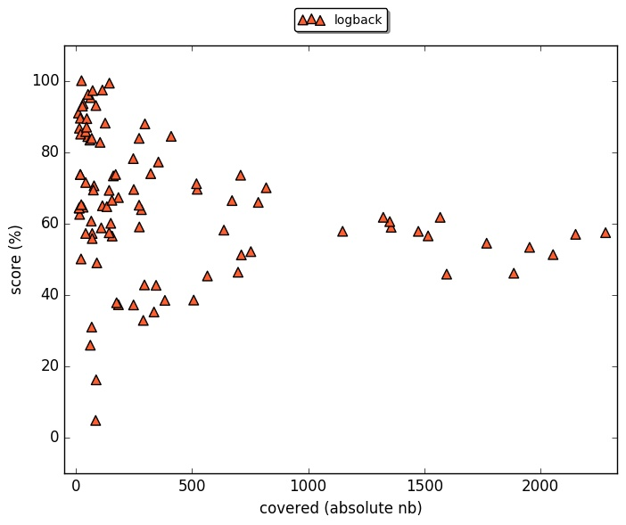
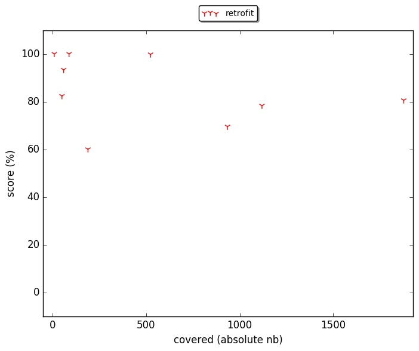

# original results of pitest mutation analysis.

Each project has its own folder for results.

In the folder 'per_class', there is for each project, a csv reports of the mutation analysis for each test class.

Following, power maps created according to results per class for each projects:

## All projects

## All projects (covered <= 1000)

## javapoet

## mybatis

## traccar

## stream-lib

## mustache.java

## twilio-java

## jsoup

## protostuff

## logback

## retrofit

